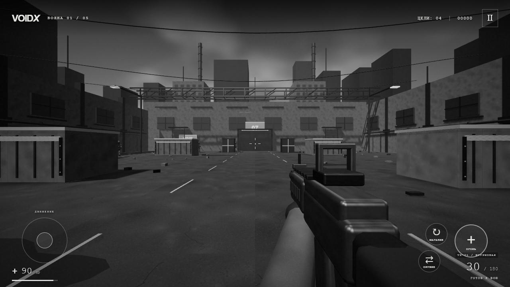

# VoidX 0.2 — «Мёртвый сектор»

Игровой прототип одиночного FPS для Android. Полностью чёрно-белая графика, строгий интерфейс и предоставленный заказчиком логотип VX. Работает офлайн, без аккаунтов, рекламы и сетевых разрешений.

## Скриншот игры



## Установка

Скачайте APK из [`releases/VoidX-0.2.0.apk`](releases/VoidX-0.2.0.apk) или из раздела GitHub Releases и откройте его на телефоне, откройте его в файловом менеджере и подтвердите установку. Если Android запросит разрешение для файлового менеджера устанавливать приложения из этого источника, включите его для установки APK.

Требуется Android 8.0 или новее, OpenGL ES 3.0 и Android System WebView с поддержкой WebGL. Держите телефон горизонтально. Игра предназначена для сенсорного управления.

## Игра

- «Начать операцию»: пережить пять волн в промышленном дворе.
- Слева — джойстик движения. Проведите пальцем по правой половине экрана для обзора.
- «Огонь»: нажмите для одиночного выстрела или удерживайте для повторных выстрелов. На кнопке можно одновременно вести прицел пальцем.
- «Магазин»: перезарядка. «Оружие»: переключение винтовки VX—01 и дробовика VX—08.
- Противники стреляют видимыми белыми снарядами; укрытия останавливают выстрелы. Можно уворачиваться.
- Каждая третья устранённая цель оставляет аптечку (+30 HP при подборе). Между волнами восстанавливаются 25 HP и пополняются резервы патронов.
- Устранение даёт 100 очков; решающее попадание в голову — 150. Победа — ещё 1000.
- Рекорд, чувствительность, громкость, качество и начальное оружие сохраняются локально. Текущий бой не сохраняется после полного закрытия приложения.
- Кнопка паузы и системная кнопка «Назад» приостанавливают бой. При сворачивании игра также ставится на паузу.

Для проверки на компьютере: WASD — движение, мышь — обзор, левая кнопка мыши — огонь, R — перезарядка, Q или 1/2 — оружие, Shift — ускорение, Esc — пауза. После запуска операции щёлкните по игровому полю для захвата мыши, если браузер не сделал этого автоматически.

## Состав проекта

- `app/src/main/java/com/voidx/game/MainActivity.java` — Android Activity, полноэкранный режим, жизненный цикл и обработчик локальных ресурсов WebView.
- `app/src/main/assets/game/` — встроенная офлайн-игра, стили, логотип и готовый JavaScript. Для сборки APK эти файлы уже подготовлены.
- `game-src/game.js` — 3D-арена, противники, звук, интерфейс, оружие и управление.
- `game-src/core.mjs` — коллизии, видимость, поиск маршрутов, параметры оружия.
- `game-src/core.test.mjs` — проверки геометрии, обхода укрытий и коллизий.
- `build.ps1` — альтернативная сборка без Android Studio и Gradle, через Android SDK Build Tools и JDK.

Графика выполнена программно на Three.js: геометрия, свет, туман, оружие, противники и эффекты. Android-приложение запускает эту игру в аппаратно ускоренном WebView. Все ресурсы упакованы в APK; запросы к `https://voidx.local` обслуживаются внутри Activity из assets, без обращения к интернету. JavaScript не имеет нативного моста.

Это первая игровая версия: одна арена, два оружия и пять волн. Мультиплеер, сюжетная кампания, магазин и облачное сохранение в неё не входят.

## Сборка через Android Studio

1. Откройте папку проекта в Android Studio и выберите JDK 17.
2. Установите Android SDK Platform 35 и Build Tools 35.0.0.
3. Дождитесь синхронизации Gradle и выполните `gradlew.bat assembleDebug` на Windows либо `sh gradlew assembleDebug` на других системах.
4. APK появится в `app/build/outputs/apk/debug/app-debug.apk`.

В проекте закреплены Gradle 8.9 и Android Gradle Plugin 8.7.3; [официальная таблица совместимости](https://developer.android.com/build/releases/agp-8-7-0-release-notes) указывает JDK 17 и поддержку API 35. Gradle Wrapper загружен из официального репозитория Gradle. Для первой сборки нужны сеть и Android SDK.

Изменения игрового кода собираются командами `npm ci`, `npm run build:game`. После этого соберите APK. Для логических тестов выполните `npm test`. Тестовые функции удаляются из итогового бандла флагом `__VOIDX_TEST__=false`.

Перед установкой самостоятельно собранной версии с другой подписью может потребоваться удалить готовый прототип с телефона. Локальные результаты при удалении приложения стираются. Для дальнейших обновлений используйте один постоянный ключ подписи.

## Альтернативная сборка

Готовый переданный APK собран скриптом `build.ps1`, используя JDK 17, официальные Android Platform 35 и Build Tools 35.0.0. Внешние инструменты не включены в архив исходников.

Укажите папку `-Toolchain` со структурой:

```
toolchain/
  jdk/jdk-17.../bin/java.exe
  android-tools/android-15/aapt2.exe
  android-platform/android-35/android.jar
```

Пример: `powershell -ExecutionPolicy Bypass -File .\build.ps1 -Toolchain D:\VoidXTools -Output D:\VoidX.apk`.

Скрипт создаёт локальный ключ подписи прототипа с паролем `android`. Для публикации используйте свой защищённый release-ключ. APK предназначен для прямой установки, публикация в Google Play не выполнялась.

## Проверено

Проверены: Java-компиляция, упаковка APK, подписи v2/v3, состав APK и манифест; браузерная 3D-сцена, сенсорные нажатия и движение, отпускание джойстика, перезарядка, смена оружия, настройки, пауза и продолжение, горизонтальная раскладка 915×412 и 1280×720, подсказка о повороте телефона.

В отдельной тестовой сборке проверены попадания и зачёт устранений, защита укрытиями, урон от снарядов, аптечки, переход к следующей волне, расход резервных патронов, отмена перезарядки, поражение, победа, сохранение рекорда и сброс операции. В обычный APK тестовый доступ не включён.

На физическом Android-устройстве и в Android-эмуляторе эту сборку не запускали. Производительность и особенности WebView конкретного телефона требуют проверки на устройстве. Альтернативная Gradle-сборка включена для разработки; переданный APK собран и проверен через `build.ps1`.

## APK`r`n`r`nГотовый APK версии 0.2: [скачать](releases/VoidX-0.2.0.apk). Android 8.0+, OpenGL ES 3.0. Переданное приложение для тестирования не прошло проверку на физическом устройстве.`r`n`r`n## Ресурсы и лицензии

Логотип предоставлен пользователем и использован в главном меню и значке приложения. Остальные игровые изображения создаются программно. Three.js 0.160.1 используется по лицензии MIT, текст — `THREE-LICENSE.txt`. Gradle Wrapper распространяется по Apache License 2.0 — `GRADLE-LICENSE.txt`.

## Обновление графики 0.2

Добавлены динамические тени, процедурные материалы с рельефом, освещение с отражениями от окружения, облачное небо, влажные участки асфальта, детали промышленного двора, скруглённое оружие, перчатки и более подробные модели противников. Все цвета остаются в оттенках серого. Код визуального оформления вынесен в `game-src/visuals.mjs`.

В лёгком режиме динамические тени отключены; стандартный использует карту теней 1024×1024, высокий — 2048×2048. Части окружения, оружия и противников объединяются по материалам, чтобы снизить число операций отрисовки. Все текстуры генерируются при запуске, сетевые ресурсы не нужны.

Проверены три режима качества без ошибок компиляции шейдеров, сенсорное управление, перезарядка, пауза, коллизии, попадания после замены моделей, переходы волн и завершение операции. Графическая проверка выполнена в Chrome с аппаратным ускорением на компьютере; производительность на Android-устройствах не измерялась.

У версии 0.2 `versionCode=2`, сохранены `com.voidx.game` и ключ подписи переданного прототипа. Готовый APK можно устанавливать как обновление версии 0.1 без удаления приложения.
